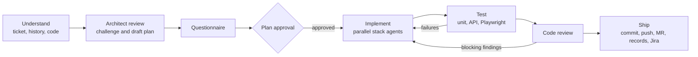
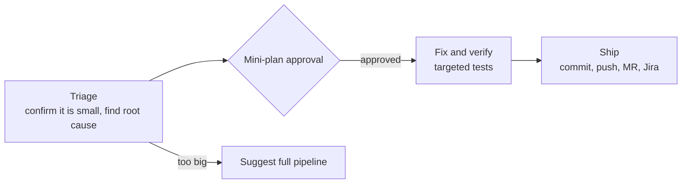

# Codilar Delivery Pipelines for Claude Code

**Plugin:** `codilar` · **Marketplace:** `codilar-tools` · **Owner:** Engineering, Codilar (joy@codilar.com)

A Claude Code plugin that runs Codilar's development workflow from requirement to merge request. You give it a Jira ticket or a plain description. It works out the context, agrees the approach with you, builds the change with agents that specialise in our stacks, tests it, and hands over a reviewed GitLab merge request with full documentation.

---

## Contents

1. [Why this exists](#why-this-exists)
2. [Pipelines](#pipelines)
3. [How a delivery works](#how-a-delivery-works)
4. [Supported stacks](#supported-stacks)
5. [Installation](#installation)
6. [Project setup](#project-setup)
7. [Using the pipelines](#using-the-pipelines)
8. [Delivery records](#delivery-records)
9. [Engineering standards and guardrails](#engineering-standards-and-guardrails)
10. [Model strategy](#model-strategy)
11. [Configuration reference](#configuration-reference)
12. [Releasing updates](#releasing-updates)
13. [Troubleshooting](#troubleshooting)
14. [Repository layout](#repository-layout)

---

## Why this exists

A large part of every ticket goes on work that isn't writing code: reading the ticket and its history, chasing unclear requirements, finding the right files, writing tests, preparing the MR description and updating Jira. This plugin standardises all of it across Codilar teams:

- **The same process on every project.** Every ticket is analysed, clarified, planned, approved, built, tested, reviewed and documented the same way.
- **Stack-specific expertise.** Agents carry our conventions for Magento, Hyva, Luma, Shopify, Akinon, Next.js, React Native and NestJS.
- **The developer stays in control.** Nothing is built until the developer approves the plan, and nothing is pushed to protected branches.
- **Traceability.** Every delivery leaves a plan, a summary, a merge request and a Jira update that a colleague can pick up months later.

## Pipelines

| Command | When to use it | Outcome |
|---|---|---|
| `/codilar:deliver-ticket <KEY>` | Standard Jira work: stories, tasks, bugs of any size | Branch `feature/<KEY>` or `task/<KEY>`, MR, plan and summary records, Jira comment |
| `/codilar:deliver [requirement]` | Work without a Jira ticket. You're asked for the requirement | Branch `feature/<name>` or `task/<name>`, MR, plan and summary records |
| `/codilar:hotfix-ticket <KEY>` | Small, well-understood Jira fixes | Branch `hotfix/<KEY>`, MR, Jira comment |
| `/codilar:hotfix [problem]` | Small fixes without a ticket | Branch `hotfix/<name>`, MR |
| `/codilar:setup-project` | Once per repository | `.claude/delivery.json`, permissions, tooling checks |

The pipelines keep each other honest. A full pipeline that finds the task is trivial suggests the hotfix path, and a hotfix that turns out to be bigger than expected suggests the full pipeline.

## How a delivery works

### Full pipeline (`deliver`, `deliver-ticket`)



1. **Understand.** It reads the ticket, all comments, subtasks, the parent epic, linked and sibling issues, attachments, earlier commits and MRs, and the affected code.
2. **Architect review.** A senior architect agent challenges the request where there's a better approach. It designs the work units, finds existing code to reuse and maps the impact on other areas.
3. **Questionnaire.** All open questions go to the developer in one round, including any proposal to duplicate logic.
4. **Plan approval.** No code is written until the developer approves `.claude/plans/<ID>.md`.
5. **Implement.** Stack agents work in parallel on units that don't overlap.
6. **Test.** Unit tests, lint, build and Playwright specs. QA runs Playwright on every pass, for UI flows and for API endpoints. Failures loop back automatically and escalate to a senior agent if needed.
7. **Review.** A strict review against the acceptance criteria, Codilar standards, security and performance.
8. **Ship.** Commits, push, GitLab MR, the delivery summary, and the Jira comment and status transition.

### Hotfix pipeline (`hotfix`, `hotfix-ticket`)



A senior model is used once, to confirm the task really is a hotfix and to shape the fix. A faster model does the work. Hotfixes don't write plan or summary files; the MR and the Jira comment are the record.

### Behaviour during a run

- **Runs to completion.** Once started, a pipeline carries on until the MR is open. It pauses only for your answers, your approval, a pipeline switch, a visual check only a person can do, or a genuine blocker. It stops early only if you tell it to.
- **Live refinements.** You can type instructions while it works. Each one is picked up straight away: unclear points are asked immediately, and the pipeline either applies the change or parks it and tells you which.
- **Parallel work.** Independent exploration, implementation, testing and review run at the same time to save time.
- **No visual QA by agents.** Behaviour is tested with automated tests, and QA always runs Playwright (browser specs for UI, `request` specs for APIs; React Native screens use Detox or Maestro). Where a check truly needs human eyes, you get a single request with the URL and what to look for.
- **Code index (graphify).** If [graphify](https://pypi.org/project/graphifyy/) is installed, the pipeline builds or refreshes a local knowledge graph of the code at the start, a hook keeps it current in the background after every code edit, and every agent finds code and checks impact through it instead of grep. Text search is kept only for markup and config the graph doesn't index (layout XML, `di.xml`, templates, Liquid). If it isn't installed, the pipeline asks once at the start of the run whether to install it, and carries on normally if you say no.

## Supported stacks

| Project type | Profile | Specialist agents |
|---|---|---|
| Magento / Adobe Commerce | `magento` | Magento backend |
| Magento with Luma frontend | `magento-luma` | Magento backend, Luma frontend |
| Magento with Hyva frontend | `magento-hyva` | Magento backend, Hyva frontend |
| Shopify (theme, app, Hydrogen) | `shopify` | Shopify |
| Akinon | `akinon` | Akinon |
| Next.js on Magento, Shopify or Akinon | `nextjs-<backend>` | Next.js, plus the backend specialist when the backend code is in the repo |
| React Native on Magento, Shopify or Akinon | `react-native-<backend>` | React Native, plus the backend specialist |
| Custom build: NestJS and Next.js | `custom-nestjs-nextjs` | NestJS, Next.js |

The stack is detected automatically and confirmed with the developer during project setup.

## Installation

### Requirements

| Requirement | Notes |
|---|---|
| Claude Code (latest) | `npm install -g @anthropic-ai/claude-code` |
| GitLab CLI | `brew install glab`, then `glab auth login --hostname gitlab.codilar.in` |
| Git access to this repository | SSH key or saved HTTPS credentials. Automatic updates can't prompt for a password |
| Jira access | Authenticated inside Claude Code with `/mcp` (the atlassian server) |
| Node.js | For Playwright and the Playwright MCP server |
| PHP / Composer (Magento projects) | Magento is run natively (Valet) |
| graphify (optional, recommended) | `uv tool install graphifyy` (or `pipx install graphifyy`). The pipelines offer to install it if it's missing |

### Option A: organisation-wide, with automatic updates (recommended)

IT or the engineering lead deploys this managed settings file to every developer machine, through the MDM tool or a one-time script:

`/Library/Application Support/ClaudeCode/managed-settings.json` (macOS)

```json
{
  "extraKnownMarketplaces": {
    "codilar-tools": {
      "source": { "source": "github", "repo": "joy-codilar/codilar-tools-claude" },
      "autoUpdate": true
    }
  },
  "enabledPlugins": {
    "codilar@codilar-tools": true
  }
}
```

With this in place, the marketplace is registered for every developer with auto-update on, and the plugin is enabled. Depending on the Claude Code version, a developer may need to run `/plugin install codilar@codilar-tools` once.

### Option B: per project

Add the same `extraKnownMarketplaces` and `enabledPlugins` blocks to a project's committed `.claude/settings.json`. Developers are prompted to install the plugin when they open and trust the project.

### Option C: manual

Inside Claude Code:

```
/plugin marketplace add joy-codilar/codilar-tools-claude
/plugin install codilar@codilar-tools
```

Then open `/plugin`, go to **Marketplaces**, select **codilar-tools** and choose **Enable auto-update**. Marketplaces outside Anthropic's own have auto-update switched off by default.

### After installing

1. Run `/mcp` and authenticate **atlassian** (Jira and Confluence).
2. Confirm that `glab auth status --hostname gitlab.codilar.in` succeeds.
3. Run `/codilar:setup-project` in each repository you work on.

## Project setup

Run once per repository:

```
/codilar:setup-project
```

It:

- detects the stack and confirms the profile with you
- asks for the MR target branch and the hotfix target branch (a pipeline never assumes a branch)
- records the Jira project key and the local URL used for tests
- works out the lint, test and build commands the project actually supports
- offers to install graphify (the code index agents search with) and to add a Playwright harness, if either is missing, listing what each one gives you
- merges the recommended permissions into `.claude/settings.json`
- runs preflight checks for GitLab, Jira, Playwright and the local site

Commit the results so the whole team shares them: `.claude/delivery.json`, `.claude/settings.json`, `.claude/plans/` and `.claude/work/`.

## Using the pipelines

```text
/codilar:deliver-ticket ABC-123
/codilar:deliver Add a "Back in stock" email opt-in on the product page for out-of-stock simple products
/codilar:hotfix-ticket ABC-130
/codilar:hotfix The mini cart shows the wrong quantity after updating an item on the cart page
```

Good practice:

- Answer the questionnaire carefully. It's the cheapest point to correct the direction.
- Read the plan before approving it, especially the impact analysis and the test plan.
- Refinements are welcome at any time, but large new scope is usually better as a follow-up ticket. The pipeline suggests this when it parks a request.

## Delivery records

The full pipelines produce two documents per task. Both are committed with the MR.

| File | Contents |
|---|---|
| `.claude/plans/<ID>.md` | The ask, context, acceptance criteria, questions and answers, approach, work units, reuse, impact analysis, test plan, risks, refinements and parked items |
| `.claude/work/<ID>.md` | Delivery summary: the ask, the plan, the questions asked and answered, the files changed, the branch and commits, how it was tested, how to verify the acceptance criteria, and other areas worth re-checking |

`<ID>` is the Jira key, or a short descriptive name when there's no ticket.

## Engineering standards and guardrails

Every agent works to the Codilar engineering standards (`skills/engineering-standards`):

1. **Architect first.** Question the request and propose a better approach where one exists.
2. **No collateral damage.** Find every usage before changing shared code, and test the areas that depend on it.
3. **DRY.** Reuse existing code. Any duplication has to be approved by the developer.
4. **Human writing.** Plain, specific comments and messages, with no em-dashes and no filler.
5. **Plan before code.** Nothing is implemented without approval.

Enforced automatically by hooks:

| Guard | What it blocks |
|---|---|
| Git guard | Pushes and commits to `main`, `master`, `develop`, `staging`, `production`, `release` and the project's target branches; force pushes; destructive Magento and database commands |
| Style guard | New em-dashes in files, commit messages, MR descriptions and Jira comments |
| Permission deny list | Reading `app/etc/env.php`, `auth.json` and `.env` files; publishing Shopify themes |

## Model strategy

Models are assigned per role to balance quality, cost and speed:

| Model | Roles |
|---|---|
| Opus | Full-pipeline orchestration, solution architect, code reviewer, senior developer (complex units, or units that failed testing twice), hotfix triage |
| Sonnet | Ticket analyst, the eight stack developers, QA engineer, hotfix orchestration |
| Haiku | Mechanical edits, release notes and summaries |

## Configuration reference

`.claude/delivery.json` (created by `setup-project`):

| Field | Purpose |
|---|---|
| `profile` | One of the stack profiles listed above |
| `components` | Detected parts of the repo (type, path, backend, themes) |
| `targetBranch` | MR target for the full pipelines |
| `hotfixTargetBranch` | MR target and base branch for hotfixes |
| `branchPrefixes` | Maps Jira issue types to `feature/` or `task/` |
| `jira.projectKeys`, `jira.transitions` | Project keys, plus the status names to move to at start and at review |
| `gitlab.host`, `gitlab.project` | GitLab instance and project path |
| `localUrl` | Base URL for API scripts and Playwright |
| `commands` | Lint, unit, build and e2e commands. `{paths}` is replaced with the changed files |
| `notes` | Project-specific guidance for the agents |

## Releasing updates

For maintainers of this repository:

1. Make and test your changes locally with `claude --plugin-dir <path-to-this-repo>` inside a sample project.
2. Run `claude plugin validate .` from the repository root.
3. **Bump `version`** in `.claude-plugin/plugin.json` (semantic versioning). Installed copies only update when the version changes.
4. Merge to `main` and push.

Developers with auto-update on receive the new version within minutes of their next Claude Code session. They can also pull it right away with `claude plugin marketplace update codilar-tools`, followed by `/reload-plugins`.

## Troubleshooting

| Symptom | Resolution |
|---|---|
| Jira tools unavailable | Run `/mcp` and re-authenticate `atlassian`. If OAuth fails, change the server URL to `https://mcp.atlassian.com/v1/mcp/authv2` |
| MR creation fails | Check `glab auth status --hostname gitlab.codilar.in` |
| GitLab MCP server doesn't connect | Not required: MRs are created with `glab`. Set `CODILAR_GITLAB_URL` to override the host |
| Repeated permission prompts for plugin tools | Run `/permissions` to see the exact tool names and adjust `settings/project-settings.json` |
| Plugin not updating | Confirm auto-update is on for `codilar-tools`, that the version was bumped, that git can reach the repository without a prompt, and that `DISABLE_AUTOUPDATER` isn't set |
| An agent ignores stack conventions | Check that the agent's `skills:` preload resolves. Fall back to bare skill names if namespaced names don't resolve in your version |
| The style guard blocks an edit | It only blocks new em-dashes. Rewrite the new text without them |
| Agents miss code that exists | The graph may be stale. Run `graphify update .` in the project, or delete `graphify-out/` and let the next run rebuild it |

## Repository layout

```
.claude-plugin/           plugin.json (name, version), marketplace.json
.mcp.json                 Atlassian, GitLab and Playwright MCP servers
hooks/hooks.json          registers the git and style guards
scripts/                  guard-git.sh, style-guard.sh, style-guard.py
settings/                 recommended project permissions (merged by setup-project)
references/               run rules, full and hotfix pipeline definitions, document templates
skills/                   pipeline entry points, setup, engineering standards, stack knowledge
agents/                   16 specialist agents
CLAUDE.md                 architecture and maintenance guide for contributors
```

---

Internal Codilar tooling. For questions, issues or feature requests, contact joy@codilar.com.
